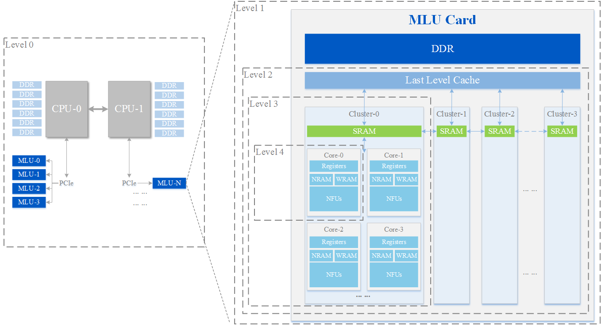
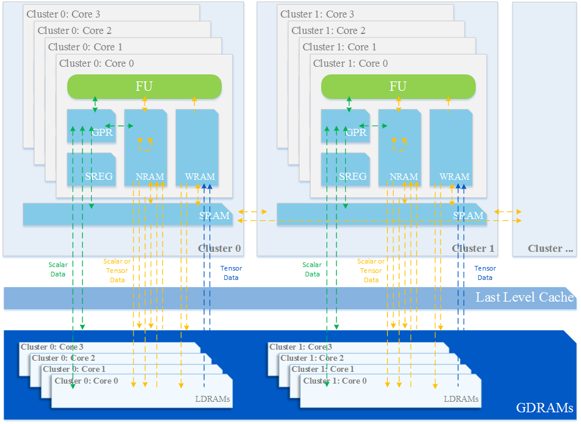
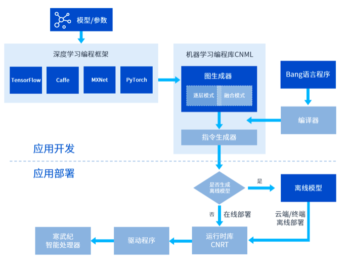
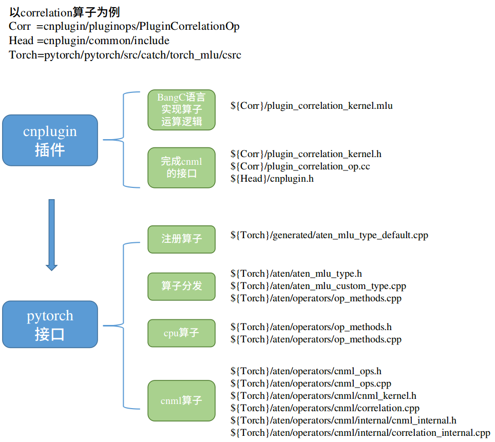

# Cambricon

#### 系统介绍
<div style="text-align: center;">



</div>

#### 存储层级
<div style="text-align: center;">



</div>

#### 开发流程
<div style="text-align: center;">



</div>

#### 开发环境准备
> neuware 1.4，pytorch框架

1. 寒武纪云端[开发平台](http://devplatform.cambricon.com:30080/), 
镜像选择 public-server/mlu270_ubuntu16.04.pytorch v1.4.0-safe

2. 寒武纪扩展版pytorch源码编译
    - 编辑 ~/.pip/pip.conf 文件
    ```bash
    [global]
    index-url = http://mirrors.aliyun.com/pypi/simple
    [install]
    trusted-host = mirrors.aliyun.com
    ```
    - 解压 Cambricon-MLU270-pytorch.tar.gz
    - 在env_pytorch.sh末尾添加
    ```bash
    export MAX_JOBS=8
    export LC_ALL=C
    export PYTHON_VERSION=python3
    ```
    - 编译
    ```bash
    source env_pytorch.sh
    bash $CATCH_HOME/script/config_for_release.sh
    ```
    - 激活和失活pytorch环境
    ```bash
    # 激活
    source env_pytorch.sh
    source $CATCH_HOME/venv/pytorch/bin/activate
    # 失活
    deactivate
    ```

#### 模型上手测试
> 代码参见

1. 生成量化权重参数
```bash
# 详细参数参见 main 函数中的 config 部分
python calibrate.py
```

2. cpu推理，mlu在线逐层推理，mlu在线融合推理
```bash
# 详细参数参见 main 函数中的 config 部分
python infer.py
```

3. 生成离线模型
```bash
# 详细参数参见 main 函数中的 config 部分
python genoff.py
```

#### 自定义插件
> 当遇到模型中有寒武纪官方未支持的算子时，需要自定义插件， 代码参见
<div style="text-align: center;">



</div>

1. 解压 Cambricon-CNPlugin-MLU270.tar.gz

2. 在 CMakeLists.txt 末尾添加安装路径

```CMakeLists
if(CMAKE_INSTALL_PREFIX_INITIALIZED_TO_DEFAULT)
  set(CMAKE_INSTALL_PREFIX /usr/local/neuware CACHE PATH "TensorRT installation" FORCE)
endif(CMAKE_INSTALL_PREFIX_INITIALIZED_TO_DEFAULT)

# Library
install(TARGETS cnplugin
        LIBRARY DESTINATION lib64)
  
# Header
install(FILES ${PROJECT_SOURCE_DIR}/common/include/cnplugin.h
        DESTINATION include)
```

3. 完成自定义算子编写，参考上图修改和添加相应文件

4. 编译

```bash
export NEUWARE_HOME=/usr/local/neuware/
./build_cnplugin.sh
cd build && make install
```

5. 完成pytorch端自定义算子接口， 参考上图修改和添加相应文件

6. 测试算子


#### 离线模型环境搭建

1. 解压 "MLU220 release_v1.5.0_m.2_x86.tar"

2. 驱动安装
```bash
cd m.2_x86_driver/
sudo dpkg -i neuware-mlu220m.2-driver-dkms_4.4.4_all.deb

 # 查看硬件信息
cnmon
```

3. neuware sdk安装
```bash
cd m.2_x86_neuware/
sudo apt install ./neuware-mlu220m.2-1.5.0-1_Ubuntu16.04_amd64.deb
sudo apt update
sudo apt install cndrv
sudo apt install cnrt
sudo apt install cncodec
sudo apt install cndev
sudo apt install cnpapi
sudo apt install cnperf
sudo apt install cnlicense
```


#### 离线模型部署
> 代码参见

1. 调用 cnrtInit() API，初始化设备

2. 调用 cnrtLoadModel() API，加载离线模型

3. 调用 cnrtSetCurrentDevice() API，设置使用的 MLU 设备

4. 调用 cnrtExtractFunction () API，提取离线模型中的模型信息

5. 通过 cnrtGetInputDataSize() 和 cnrtGetOutputDataSize() API 获得输入和输出数据的内存大小

6.  调用 cnrtMalloc() API，为 MLU 输入数据分配内存指定空间

7. 调用 cnrtMemcpy() API，同步拷贝主机端数据到 MLU 端

8. 调用 cnrtMalloc() API，为 MLU 输出数据分配内存指定空间

9. 设置 Context
    - 调用 cnrtCreateRuntimeContext() API，创建 Context
    - 调用 cnrtSetRuntimeContextDeviceId() API，绑定设备
    - 调用 cnrtInitRuntimeContext() API，初始化 Context
    - 调用 cnrtRuntimeContextCreateQueue() API，创建队列

10. 调用 cnrtInvokeRuntimeContext() API，将任务下发到队列

11. 调用 cnrtSyncQueue() API，同步任务

12. 调用 cnrtMemcpy() API，将计算结果从 MLU 拷出到 CPU


#### 注意事项
1. 总的来说，寒武纪有一整套完整的硬件和软件工具可以直接对标英伟达，但是还远未完善。它不光要自己搞硬件，还要自己完成上层软件（深度学习框架）的适配，工作量不可谓不大。关键是它的开放程度不够，仅对签署了协议的合作方提供软硬件支持，社区也寂静无声，这怎么能迅速发展。现在国际间的形式更会让我们选择使用国内的解决方案，寒武纪完全可以把上层软件开放出来，相信会有很多开发者来一起完善上层软件的。

2. 使用过程中，主要的错误来源在于对前端深度学习框架支持的不完善。在后端设备为mlu时，大意使用api会出现一些隐蔽的错误，还不会提示信息。

  如pytorch中的.to操作，统一了数据在device和dtype类型转化的api。然而后端为mlu时，则不行。
  ```python
  # x为mlu端float16数据
  x = x.to(torch.float32) # x.dtype 仍然是float16的数据 

  # y为cpu端float32数据
  x = x.to(y) # x 变成cpu端float32类型数据，但是值完全变了
  ```
  如 F.pad 操作，需要将左右上下的pad都填上，mlu才能给出正确的结果。
  ```python
  # x为mlu端数据
  x = F.pad(x, (1,1,0,0)) # 正常
  x = F.pad(x, (1,1)) # 错误
  ```

3. 一些外来的tensor不会被加载到离线模型当中，导致离线推理错误。 

4. mlu端的数据存储为channel last，和pytorch不同

5. mlu的物理计算单元很少，mlu220有4个，270有16个。像是拿掉了复杂指令逻辑的cpu集合。

6. 模型有两个输入，导出离线模型后会将输入的顺序互换。